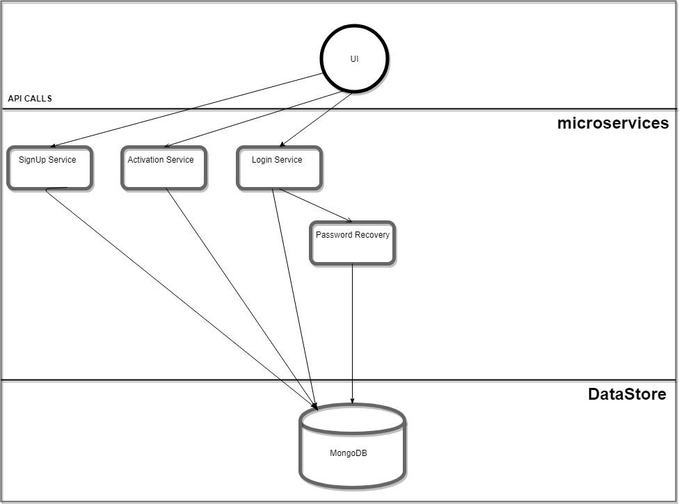

# Progress and Documentation for Okey Onyia
## The Design
This server is designed and being built with ***microservice** architecture, where each service runs in ***parallel*** with one another and in  ***series*** with the central datastore (MongoDB).

I'm building this server in a TEST-DRIVEN development approach leveraging Golang's net/http/httptest package for unit testing

## Tasks for week One
-   [x] Comprehensive research on Implementation of Idea and Technology to achieve this
-   [x] Build a Contineous Integration Pipeline with  Git
-   [x] Alert Team members to test the Integration Pipepline and Mark their names to indicate successful Integration
### Instructions on how to Test Integration
-   ***Step1***
         Clone the repo on your command line using Git with the following command
             **$** `git clone https://github.com/gowashteam/gowash.git`
-   ***Step2***
         Open the file ***testaccess.txt***
         Follow the instruction on the file
-   ***Step3***
         Commit the change then Push the commit back to the remote repo
-   ***Step4***
         Go to https://github.com/gowashteam/gowash/blob/master/testaccess.txt and check to see if the change reflects.
         If you see the change then your Contineous Integration Test Passed. IF not, Please let me know and I will help             figure out the problem.
-   ***Step5*** Check your name below when DONE and then commit and push back to repo
       - [x] @gowashteam/okeyonyia123
      - [ ] @gowashteam/KRUTI
      - [ ] @gowashteam/charmishah928
      - [ ] @gowashteam/Keyaa12
## Task for Week Two
### Provision A Virtual Private Server and deploy MongoDB database
-  [x]  Provision a Virtual Private Server with Digital Ocean
    -   Generate a token from Digital Ocean and copy to clipboard
    -   Provision a VM
        - **$** `docker-machine create --driver digitalocean --digitalocean-access-token ****** gowash `
-   [x] Set the Envirunment variable from your Development Machine with `Docker-Machine Eval`
    - **$** `eval $(docker-machine env gowash)`
-   [x] Pull a MongoDB Image from DockerHub
    - **$** `docker pull mongo`
-   [x] Run a new instance in a Docker container
    - **$** `docker run -p27017:27017 --name gowashmongo -d mongo`
-   [x] Deploy the Container on the Virtual Private Server then Get the Socket for communication with other microservices
    - **Gowash Container is already running Live**

### MICROSERVICES

###  SIGNUP new account
-   [x] Build and test handlers
-  Servers
    -   Signup
        - handlers
          -  [x] ***homepage.go***
          -  [ ] ***signup.go***
        - datastore
          - [x] ***datastore.go***
          - [x] ***mongodb.go***
        - models
          - [x] ***user.go***
        - tests
          - [x] ***homepage_test.go***
        - utilities ( ***Re-usable class*** )
           -    [x] ***sha256.go***
           -    [x] ***uuid.go***
        - [x] ***SignupServer.go***

### ACTIVATE new account
-  Servers
    -   ActivaeUSer
        - handlers
          -   [ ] ***activateUser.go***
        - utilities ( ***Re-usable class*** )
           -    [ ] ***sha256.go***
           -    [ ] ***uuid.go***
        - [ ] ***ActivateUserServer.go***

### LOGIN-USER
-  Servers
    -   Login
        - handlers
          -   [ ] ***login.go***
        - utilities ( ***Re-usable class*** )
           -    [ ] ***sha256.go***
           -    [ ] ***uuid.go***
        - [ ] ***loginServer.go***

### RECOVER-PASSWORD
-  Servers
    -   RecoverPassword
        - handlers
          -   [ ] ***passwordRecovery.go***
        - utilities ( ***Re-usable class*** )
           -   [ ] ***sha256.go***
           -    [ ] ***uuid.go***
        - [ ] ***PRServer.go***
